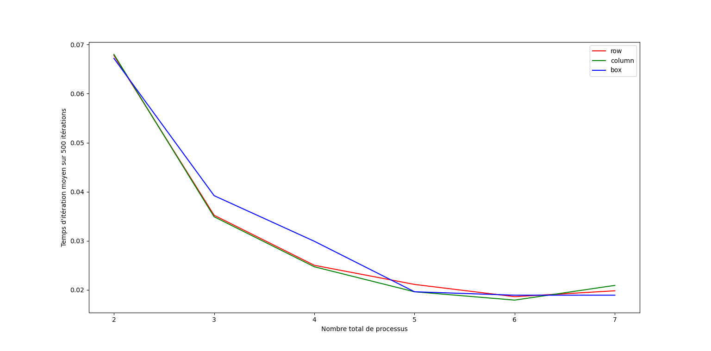

# Projet Calcul parallèle : le jeu de la vie

## Introduction

Le but de ce projet a été de paralléliser le jeu de la vie sur une grille torique en utilisant
une décomposition de domaine. Plusieurs types de découpages ont été explorés et des comparaisons
de performances ont été réalisées.

L'ensemble des fichiers ont été codés en `Python` avec la librairie de calcul parallèle `mpi4py`.

## Présentation des fichiers

La parallélisation repose sur le principe suivant :
- séparation des processus en un **processus d'affichage** (rank global 0) et des **processus de calcul** (les autres) ;
- chaque processus de calcul possède une sous-grille locale avec des **cellules fantômes** (ghost cells) sur ses bords, mises à jour par échanges avec les voisins à chaque itération ;
- les résultats sont envoyés au processus 0 via `gather` pour mise à jour et affichage.

Le projet est scindé en 4 fichiers :

- `game_of_life_2process.py` : version de référence à exactement 2 processus. Un processus calcule l'intégralité de la grille, l'autre l'affiche. Pas de découpage de domaine.
- `game_of_life_nprocess_column.py` : parallélisation 1D par **colonnes**. La grille est découpée en bandes verticales, chaque processus de calcul gère une bande. Les échanges de ghost cells se font uniquement entre voisins gauche/droite.
- `game_of_life_nprocess_row.py` : parallélisation 1D par **lignes**. La grille est découpée en bandes horizontales. Les échanges de ghost cells se font uniquement entre voisins haut/bas.
- `game_of_life_nprocess_box.py` : parallélisation **2D par boîtes**. La grille est découpée en sous-grilles rectangulaires. Chaque processus échange des ghost cells avec ses 8 voisins (haut, bas, gauche, droite et les 4 diagonales).

## Performances

Les  **temps moyen par itération** (s) pour différents nombre de processus de calcul ont été mesurées sur chaque processus avec le pattern `glider` (grille 100×90) sur un total de 500 itérations. L'ordinateur utilisé possède Windows comme système d'exploitation, 6 coeurs physiques et 12 coeurs logiques. Les mesures permettent de constater que les tâches sont bien équilibrés entre l'ensemble des processus. Le tableau suivant n'affiche donc les mesures de temps que pour le pour le premier processus de calcul :

| Nombre total de processus | 1D Lignes (s) | 1D Colonnes (s) | 2D Boîtes (s) |
|:-------------------:|:----------------:|:--------------:|:--------------:|
| 2                  | 0.0678           | 0.0680          | 0.0672          |
| 3                   | 0.0352           | 0.0349          | 0.0392          |
| 4                   | 0.0250           | 0.0247        | 0.0299         |
| 5                   | 0.0211           | 0.0196         | 0.0196        |
| 6                   | 0.0186           | 0.0179         | 0.0189         |
| 7                   | 0.0198          | 0.0209        | 0.0189        |

<figure>
    
</figure>

Nous constatons relativement peu de différences entre les méthodes. Mentionnons toutefois que la méthode utilisant les boîtes est peu plus lente dans les cas où elle se réduit à un  découpage seulement en ligne et seulement en colonnes. Cela est probablement lié à la complexification du code et au fait que le fichier apelle dans ces cas-là le fichier pour les colonnes ou les lignes. 

Finalement, il apparaît que le speedup augmente avec l'augmentation du nombre de processus associés à des coeurs physiques. Il semble cependant commencer à stagner avec l'ajout d'un processeur logique. Dans l'ensemble, ces augmentations ne suivent pas une loi linéaire en fonction du nombre de processus. Cela peut être expliqué par le fait que les envois des messages pour la gestion des cellules fantômes imposent des opérations supplémentaires coûteuses qui ralentissent le déroulement des itérations.